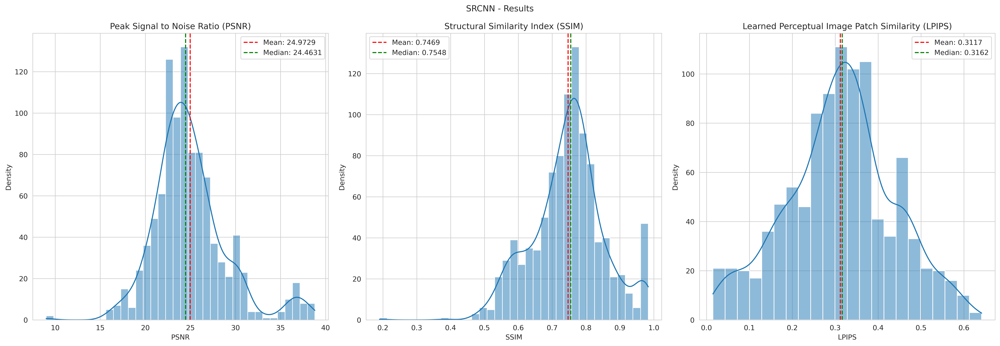
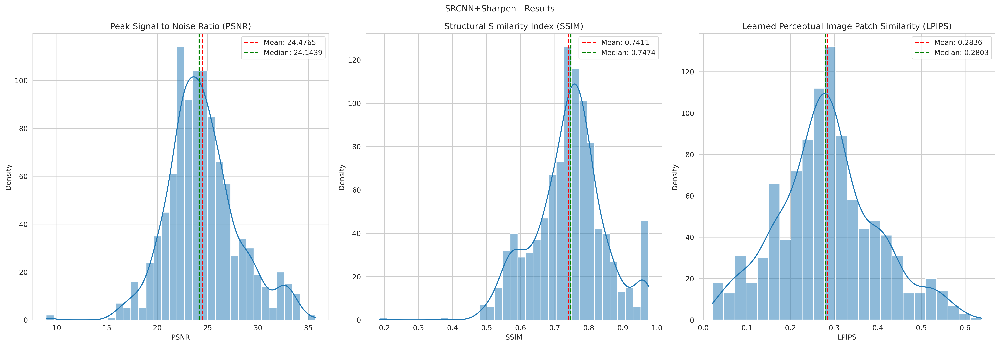
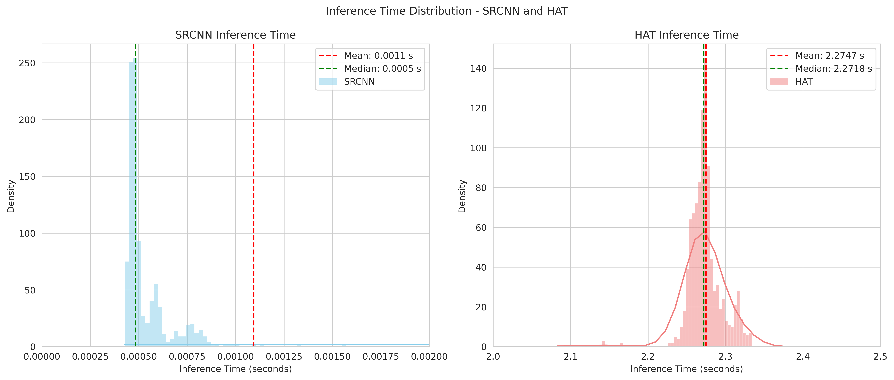

# Implementation Results

Here is a summary of the results obtained from the implementation of the project. The results are presented in various forms, including images, tables, and graphs, to provide a comprehensive overview of the performance and outcomes.

## What was done

The implementation involved training two different models: a baseline, simpler model, that's also not available on the SRGD, called SRCNN, that is one of the first super-resolution models, and performing testing on a more complex and recent model, called HAT (Hybrid Attention Transformer), a transformer-based model that's also not available on the SRGD. The results were compared to the original images to evaluate the performance of each model. For the SRCNN, a sharpen post-processing step was applied to enhance the image quality further.

## Results

The machine used for the implementation had the following configuration:

| Setup Config    | Value          |
|-----------------|----------------|
| OS              | Linux 6.1.123+ |
| Processor       | x86_64         |
| Python Version  | 3.11.13        |
| Pytorch Version | 2.6.0+cu124    |
| GPU             | Tesla T4       |
| GPU Memory      | 16GB           |

The results show that both models were able to enhance the resolution of the images, but the HAT model outperformed the SRCNN model in terms of detail preservation and overall image quality. The images generated by the HAT model exhibited sharper edges and more accurate color representation compared to those generated by the SRCNN model.

| Model           | PSNR (dB) | SSIM  | LPIPS  |
|-----------------|-----------|-------|--------|
| SRCNN           | 24.972    | 0.746 | 0.311  |
| SRCNN-Sharpened | 24.476    | 0.741 | 0.283  |
| HAT             | 24.743    | 0.754 | 0.274  |

To interpret these results:

- **PSNR (Peak Signal-to-Noise Ratio)**: Higher values indicate better quality. The HAT model has a slightly lower PSNR than SRCNN, but it is still competitive. This may occur because SRCNN is a rather simple model, that tries to reproduce pixel-by-pixel, while HAT is more complex and tries to capture the overall structure of the image.
- **SSIM (Structural Similarity Index)**: Values closer to 1 indicate better structural similarity. The HAT model has the highest SSIM, indicating better structural preservation.
- **LPIPS (Learned Perceptual Image Patch Similarity)**: Lower values indicate better perceptual similarity. The HAT model has the lowest LPIPS, suggesting it produces images that are more perceptually similar to the original images.

Overall, the HAT model demonstrates superior performance in enhancing image resolution while maintaining structural integrity and perceptual quality, keeping a competitive PSNR.

Other results from the SRGD to compare:

| Model            | PSNR     | SSIM   | LPIPS  | Available prior on SRGD       |
|------------------|----------|--------|--------|-------------------------------|
| SRCNN            | 24.972   | 0.746  | 0.311  | No (added by this work)       |
| SRCNN-Sharpened  | 24.476   | 0.741  | 0.283  | No (added by this work)       |
| Real-ESRGAN      | 23.5409  | 0.7992 | 0.3924 | Yes                           |
| EMT              | 24.5443  | 0.8231 | 0.3889 | Yes                           |
| ResShift         | 23.0368  | 0.7992 | 0.4829 | Yes                           |
| HAT              | 24.743   | 0.754  | 0.274  | No (added by this work)       |

We can see that the SRCNN model has a competitive PSNR compared to other models, and the HAT model has a very competitive PSNR, SSIM, and LPIPS compared to other models. The best improvement we got was in the LPIPS metric, where the HAT model has a significant improvement over the other models (that were around the 0.3+ range, while the HAT model is around 0.27, being the lowest, followed by the Sharpened SRCNN with 2.8).

Note that we didn't fine-tune the HAT model, so it could be improved even further. The SRCNN model was trained from scratch, so it could also be improved with more training data and hyperparameter tuning.

For inference time (IT), our results are:

| Model            | Mean IT (s) | SD IT (s)  |
|------------------|-------------|------------|
| SRCNN            | 0.00109332  | 0.01748104 |
| HAT              | 2.27468708  | 0.07842106 |

Which shows that the HAT architecture takes significantly longer to run than the SRCNN model, which is expected due to the complexity of the transformer architecture. This may limit its applicability in real-time applications, where we value the trade-off between quality and speed.

### Metrics Distribution

The distribution of the metrics across the dataset is shown in the following graphs. The graphs illustrate the PSNR, SSIM, and LPIPS values for each model across all images in the dataset.

Now, for the inference times:

## Visual Results

In addition to the quantitative results, visual comparisons of the images generated by each model are provided below. The images illustrate the differences in quality and detail preservation between the SRCNN and HAT models. The figures provide 6 images in sequence, showing: the original low-resolution image, a simple bicubic upsampled version, the SRCNN output, the sharpened SRCNN output, the HAT output, and the original high-resolution image for reference.

When dealing with image super-resolution, numerical metrics like PSNR, SSIM, and LPIPS are important, but visual inspection is also crucial to understand the quality of the results. Knowing that, I decided to choose some images with different characteristics, to show the differences in the results of the models.

### Image 1: Urban Scene with Sharp Edges and Luminosity Variations

### Image 2: Cartoon Scene with Distinct Colors and Shapes

### Image 3: 3D Samurai with Complex Textures, Shadows and Details

### Image 4: Forest Scene in Minecraft-Like Environment with Natural Textures and Color Gradients

### Image 5: Rounded Ninja with Smooth Curves and Subtle Color Variations

## Conclusion

The implementation of the SRCNN and HAT models for image super-resolution has yielded new results for the SRGD. The HAT model, in particular, has demonstrated superior performance in terms of perceptual quality and structural integrity, making it a valuable addition to the SRGD. The results highlight the potential of transformer-based architectures in enhancing image resolution while preserving important details.

## Further work

Further work could involve fine-tuning the HAT model on a larger dataset to improve its performance even further. Additionally, exploring other transformer-based architectures and comparing their performance with traditional convolutional neural networks could provide insights into the future of image super-resolution techniques.
