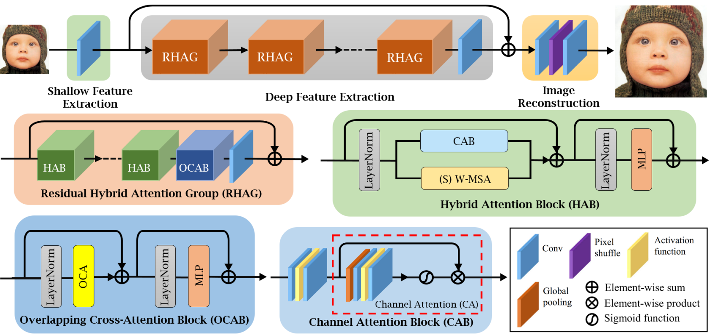

# Introduction to Deep Learning: Project Literature Review

| Information | Details     |
| ----------- | ----------- |
| Course      | Introduction to Deep Learning (`INF2475_3WA_2025.1`) |
| Professor   | Paulo Ivson (<pivson@inf.puc-rio.br>) |
| Student     | Gabriel Ribeiro Gomes (<ggomes@inf.puc-rio.br>, <ribeiroggabriel@gmail.com>) |
| Topic       | Literature Review for Deep Learning |
| Theme       | Super Resolution in Video Games |

## Table of Contents

0. [Opening remarks](#opening-remarks)
1. [Introduction & Problem Statement](#1-introduction--problem-statement)
   - [1.1. Super Resolution](#11-super-resolution)
   - [1.2 Goal of the project](#12-goal-of-the-project)
2. [Related Work](#2-related-work)
   - [2.1. Common Algorithms](#21-common-algorithms)
   - [2.2. Metrics overview](#22-metrics-overview)
       - [2.2.1. Peak Signal-to-Noise Ratio (PSNR)](#221-peak-signal-to-noise-ratio-psnr)
       - [2.2.2. Structural Similarity Index (SSIM)](#222-structural-similarity-index-ssim)
       - [2.2.3. Learned Perceptual Image Patch Similarity (LPIPS)](#223-learned-perceptual-image-patch-similarity-lpips)
3. [Proposed Solution](#3-proposed-solution)
   - [3.1. Hybrid Attention Transformer (HAT)](#31-hybrid-attention-transformer-hat)
   - [3.2. Understanding the architecture of the HAT](#32-understanding-the-architecture-of-the-hat)
       - [3.2.1. Shallow Feature Extraction](#321-shallow-feature-extraction)
       - [3.2.2. Deep Feature Extraction](#322-deep-feature-extraction)
           - [Residual Hybrid Attention Group (RHAG)](#residual-hybrid-attention-group-rhag)
           - [Hybrid Attention Block (HAB)](#hybrid-attention-block-hab)
           - [Overlapping Cross-Attention Block (OCAB)](#overlapping-cross-attention-block-ocab)
           - [Channel Attention Block (CAB)](#channel-attention-block-cab)
       - [3.2.3. Image Reconstruction](#323-image-reconstruction)
4. [Expected Benefits](#4-expected-benefits)
5. [References](#5-references)

## Opening remarks

I don't remember exactly when I got my first video game console, but I do remember that was a Master System console with the Sonic the Hedgehog game. I was never able to finish the game on my own, but I remember that I used to play it a lot with my parents. Since then, I've never skipped a generation of consoles, being amazed by how the gaming industry evolved over the years, creating incredible experiences and stories. Eventually I grew up a nerd and now work in AI, and still love video games. This work is a way to combine those passions, and a way to learn more about the current state of the art in super resolution techniques, which is a topic that I find fascinating. I hope you enjoy reading this literature review as much as I enjoyed writing it.

## 1. Introduction & Problem Statement

> "It’s dangerous to go alone, take this!" - Old Man from *The Legend of Zelda*

Video games are an integral part of modern entertainment and culture nowadays, with a market size of over $274 billion dollars calculated in 2024[1]. With the rapid advancement of technology, the demand for high-quality graphics and immersive experiences in newer video games has increased significantly. To meet this demand, game developers are constantly pushing the boundaries of graphics and visual fidelity on current hardware. High-resolution textures and assets are essential for creating realistic environments and characters that enhance the overall gaming experience. As a result, the video game industry is witnessing a growing trend towards higher resolutions, with many games now supporting 2K, 4K and even 8K resolutions[2].

However, the development of high-resolution textures and assets can be time-consuming and resource-intensive. Graphic processing units (GPUs) and other hardware components must be capable of rendering these high-resolution assets in real-time, multiple frames per second (FPS). This can be a significant challenge, especially while textures and assets are evolving at a faster pace than hardware capabilities[3].

### 1.1. Super Resolution

This is where super resolution techniques come into play, particularly those leveraging deep learning methods. Super resolution[4] refers to the process of enhancing the resolution of images or videos, allowing for the generation of high-quality visuals from lower-resolution sources. Using those techniques, graphic assets can be rendered at lower resolutions and then upscaled to higher resolutions without losing significant detail or quality. This is particularly useful in the gaming industry, where real-time rendering is crucial for maintaining a smooth and immersive experience.

Two major players on the graphics market, NVIDIA and AMD, have already implemented super resolution techniques in their graphics cards. NVIDIA's Deep Learning Super Sampling (DLSS) [5] and AMD's FidelityFX Super Resolution (FSR) [6] are examples of how these companies are leveraging deep learning to enhance the gaming experience. DLSS technologies are locked behind their respective hardware, which means that they are not available for all users, while FidelityFX is open to other vendors and even has its own SDK. This has led to a growing interest in exploring and developing super resolution techniques that can be applied to video games, particularly those that are not limited to specific hardware.

### 1.2 Goal of the project

The goal of this project will be to explore the current state of super resolution techniques in the video game industry, focusing on deep learning methods. Even with all of the advancements in the area, we do not have many publicly available datasets focused on Super Resolution for gaming content. To study this, we will leverage the Super Resolution Gaming Dataset, that was created by Evgenii Pishchik and is available on both GitHub[7] and Kaggle[8] platforms since last year. The dataset consists of multiple images in different resolutions generated by the Unreal Engine game engine. Some algorithms are already implemented in the dataset, so we will explore the performance of other algorithms, both more modern and older, and compare them with the existing ones.

## 2. Related Work

> "I used to be an adventurer like you, until I took an arrow to the knee." - Guard from *Skyrim*

Over the years, a variety of methods have been proposed to address super resolution problems. A review of the literature shows, it is possible to find the following main categories of algorithms: classic interpolation methods, convolutional neural networks (CNNs), generative adversarial networks (GANs), and more recent approaches using transformers and diffusion models. Each of these categories has its own strengths and weaknesses, and the choice of algorithm depends on the specific requirements of the application. While the first category is more traditional and based on simpler mathematical models, the latter categories leverage deep learning techniques to achieve better results. The following sections will provide an overview of the machine learning based categories and their respective algorithms, with table 1 summarizing the main features of each algorithm and its performance metrics on the SRGD dataset.

### 2.1. Common Algorithms

The table 1 will present a summary of super resolution algorithms.

| Model | Architecture Type | Main Architectural Features  | Strengths | Weaknesses | Performance Metrics Reported (on SRGD) |
|----|----|----|----|----|----|
| SRCNN[9] | CNN | 3 convolutional layers, initial bicubic upscaling | Pioneer, simple, established end-to-end learning for SR | Limited performance, blurs fine details | Not reported on SRGD |
| EDSR[10]      | CNN (Residual)    | Deep network, multiple residual blocks, no normalization, batch upscaling at the end | High performance, good detail reconstruction            | Computationally intensive                         | Not reported on SRGD                             |
| SRGAN[11]        | GAN               | Residual block generator, discriminator, perceptual loss (VGG) | Focus on perceptual quality, generates more realistic textures | May introduce artifacts                           | Not reported on SRGD                             |
| ESRGAN[12]       | GAN               | RRDB generator, RaGAN discriminator, improved perceptual loss (VGG pre-activation) | Superior perceptual quality compared to SRGAN, sharper and more natural textures | Computationally intensive                         | Not reported on SRGD                             |
| Real-ESRGAN[13]  | GAN               | Multi-scale discriminator, adversarial loss, focused on real-world degradations | Robust to real-world degradations, good for complex textures | Limited generalization across different image types | PSNR: 23.5409, SSIM: 0.7992, LPIPS: 0.3924       |
| EMT[14]          | Transformer       | MTB Blocks (Pixel Mixer + Self-Attention), striped window for SA | Good modeling of local and global dependencies, complexity-efficient | More recent, may require further investigation for specific applications | PSNR: 24.5443, SSIM: 0.8231, LPIPS: 0.3889       |
| ResShift[15]     | Diffusion Model   | Markov chain for HR-LR transition via residual shifting  | Efficient sampling steps, good balance between quality and efficiency | Relatively new approach to SR                     | PSNR: 23.0368, SSIM: 0.7992, LPIPS: 0.4829       |

*Table 1 - Summary of super resolution algorithms and their performance metrics on the SRGD dataset. The performance metrics are reported as PSNR, SSIM, and LPIPS values.*

### 2.2. Metrics overview

It is important to understand the metrics presented in the table. The most common metrics used to evaluate super resolution algorithms are Peak Signal-to-Noise Ratio (PSNR), Structural Similarity Index (SSIM), and Learned Perceptual Image Patch Similarity (LPIPS).

#### 2.2.1. Peak Signal-to-Noise Ratio (PSNR)

PSNR[16] measures the ratio between the maximum possible power of a signal and the power of corrupting noise and is calculated by:

$$
PSNR = 10 \cdot \log_{10} \left( \frac{MAX^2}{MSE} \right)
$$

Where:

- \(MAX\) is the maximum possible pixel value of the image (255 for 8-bit images).
- \(MSE\) is the mean squared error between the original and the super-resolved image.
- A higher PSNR value indicates better image quality.

#### 2.2.2. Structural Similarity Index (SSIM)

SSIM[17] assesses the similarity between two images based on luminance, contrast, and structure. It is calculated using the following formula:

$$
SSIM = \frac{(2\mu_x\mu_y + C_1)(2\sigma_{xy} + C_2)}{(\mu_x^2 + \mu_y^2 + C_1)(\sigma_x^2 + \sigma_y^2 + C_2)}
$$

Where:

- $\mu_x$ and $\mu_y$ are the average luminance of the original and super-resolved images, respectively.
- $\sigma_x^2$ and $\sigma_y^2$ are the variances of the original and super-resolved images, respectively.
- $\sigma_{xy}$ is the covariance between the original and super-resolved images.
- $C_1$ and $C_2$ are small constants to stabilize the division.
- SSIM values range from -1 to 1, with 1 indicating perfect similarity.

#### 2.2.3. Learned Perceptual Image Patch Similarity (LPIPS)

LPIPS[18] is a perceptual metric that evaluates the similarity between two images based on deep features extracted from a pre-trained neural network. It is calculated using a model that is trained on a labeled dataset of human-judged perceptual similarity. A higher LPIPS score indicates lower perceptual similarity, while a lower score indicates higher perceptual similarity. The LPIPS metric is particularly useful for evaluating the quality of super-resolved images, as it aligns more closely with human perception compared to traditional metrics like PSNR and SSIM.

## 3. Proposed Solution

> "It's super effective!" - *Pokémon*

Recently, a technique called Hybrid Attention Transformer (HAT) was proposed on a paper called "Activating More Pixels in Image Super-Resolution Transformer", in 2023[19]. This model has been widely tested for image restoration tasks involving super resolution[20, 21, 22]. The idea is to bring the power of the HAT algorithm to benchmark it against the existing algorithms in the Super Resolution Gaming Dataset.

### 3.1. Hybrid Attention Transformer (HAT)

The authors’ motivation behind the HAT technique was to leverage the power of transformers due to the great results they have been achieving in the last years, especially in the field of natural language processing. Alongside that, a wide range of transformer-based networks were already being proposed on the field of super resolution, and obtaining significant results due to the powerful representation abilities of the transformer[21]. The HAT model consists of three main parts: a shallow feature extraction part, a deep feature extraction part and an image reconstruction part. Figure 1 shows the architecture of the model.

*Figure 1 - Hybrid Attention Transformer's Architecture. Reference [19].*

### 3.2. Understanding the architecture of the HAT

#### 3.2.1. Shallow Feature Extraction

This stage consists of a single convolutional layer that processes the input image to extract initial low-level features. The output of this layer is split into two paths:

- One path is sent to the deep feature extraction module.
- The other path bypasses deep processing and is directly used in the image reconstruction step via a residual connection (element-wise sum).

#### 3.2.2. Deep Feature Extraction

This stage is the core of the HAT model and consists of multiple Residual Hybrid Attention Groups (RHAGs), followed by a final convolutional layer. The RHAGs are designed to progressively refine features by capturing both short- and long-range dependencies.

#### Residual Hybrid Attention Group (RHAG)

Each RHAG contains a sequence of Hybrid Attention Blocks (HABs) followed by a single Overlapping Cross-Attention Block (OCAB). A final convolutional layer is applied at the end. The residual connection within RHAG helps preserve and integrate information from earlier layers.

#### Hybrid Attention Block (HAB)

The HAB is the fundamental unit of the network. It combines:

- A Channel Attention Block (CAB) to model inter-channel relationships.
- A Shifted Window Multi-Head Self-Attention (S-W-MSA) mechanism to capture spatial dependencies with reduced computational cost.

Each HAB also includes Layer Normalization and a Multi-Layer Perceptron (MLP), and employs residual connections to facilitate training and gradient flow.

#### Overlapping Cross-Attention Block (OCAB)

The OCAB is designed to enhance feature interaction across spatial regions using Overlapping Cross Attention (OCA). This mechanism strengthens the model's ability to understand contextual information between neighboring regions. Similar to HAB, it includes normalization layers and an MLP.

#### Channel Attention Block (CAB)

The CAB focuses on learning inter-channel dependencies. It applies global pooling followed by convolutional transformations and a sigmoid activation to generate channel-wise attention weights, which are used to rescale feature maps adaptively.

#### 3.2.3. Image Reconstruction

In the final stage, the features from the shallow and deep branches are combined via element-wise addition. The resulting feature map passes through:

- A convolutional layer.
- A pixel shuffle operation (used for upscaling).
- And another convolutional layer to reconstruct the high-resolution output image.

## 4. Expected Benefits

> "Praise the Sun!" - Solaire of Astora from *Dark Souls*

The expected benefits of this project include evaluating a new algorithm against the existing ones in the SRGD, with the aim of outperforming them and introducing a new benchmark variant to the dataset. This will be a new approach for the HAT algorithm, as it has not been tested on video game content before, being benchmarked in datasets like DIV2K and Urban100.

Additionally, the project will provide a comprehensive overview of the SRGD, that is a large dataset with more than 50GBs of data, conducting exploratory data analysis (EDA) to better understand the dataset's structure. This will help us to understand the strengths and weaknesses of the dataset, paving the way for future research and development in the field of super resolution techniques for video games with the SRGD. Findings will be shared openly on GitHub, contributing to the open-source community and potentially improving existing algorithms or developing new ones.

Finally, if time allows, we will also explore more basic algorithms, such as SRCNN, to understand the differences between them and the more complex ones. This will help us to understand the evolution of super resolution techniques and their impact on the gaming industry, while also which may also enable experimentation by enthusiasts, given its computational simplicity to explore the topic further and benchmark the other algorithms in the dataset.

## 5. References

> "The courage to walk into the Darkness, but strength to return to the Light." - Parables of the Allspring from *Destiny*

[1]: Precedence Research: "Video Games Market Size, Share, and Trends 2025 to 2034", 31/01/2025. Available at [Link](https://www.precedenceresearch.com/video-game-market). Accessed on 30/03/2025.

[2]: CTA - Consumer Technology Association: "8K Gets Bigger as Video Services Diversify", 17/11/2020. Available at: [Link](https://www.cta.tech/Resources/i3-Magazine/i3-Issues/2020/November-December/8K-Gets-Bigger-as-Video-Services-Diversify). Accessed on 30/03/2025.

[3]: TechRadar: "Playing Assassin's Creed Shadows at 8K with the Nvidia RTX 5090 was a nightmare - until I turned on Multi Frame Gen", 22/03/2025. Available at: [Link](https://www.techradar.com/computing/gaming-pcs/playing-assassins-creed-shadows-at-8k-with-the-nvidia-rtx-5090-was-a-nightmare-until-i-turned-on-multi-frame-gen). Accessed on 30/03/2025.

[4]: Wikipedia: "Super Resolution". Available at: [Link](https://en.wikipedia.org/wiki/Super-resolution_imaging). Accessed on 30/03/2025.

[5]: NVIDIA: "Deep Learning Super Sampling (DLSS)". Available at: [Link](https://www.nvidia.com/pt-br/geforce/technologies/dlss/). Accessed on 30/03/2025.

[6]: AMD: "AMD FidelityFX". Available at: [Link](https://www.amd.com/pt/products/graphics/technologies/fidelityfx.html). Accessed on 30/03/2025.

[7]: GitHub: "Super Resolution Gaming Dataset (SRGD)". Available at: [Link](https://github.com/epishchik/SRGD). Accessed on 30/03/2025.

[8]: Kaggle: "Super Resolution Gaming Dataset (SRGD)". Available at: [Link](https://www.kaggle.com/competitions/super-resolution-in-video-games). Accessed on 30/03/2025.

[9]: Dong, C., Loy, C. C., He, K., & Tang, X. (2015). "Image Super-Resolution Using Deep Convolutional Networks". *arXiv preprint* arXiv:1501.00092. Available at: [Link](http://arxiv.org/abs/1501.00092). Accessed in 31/03/2025.

[10]: Lim, B., Son, S., Kim, H., Nah, S., & Lee, K. M. (2017). "Enhanced Deep Residual Networks for Single Image Super-Resolution". *arXiv preprint* arXiv:1707.02921. Available at: [Link](http://arxiv.org/abs/1707.02921). Accessed in 31/03/2025.

[11]: Ledig, C., Theis, L., Huszar, F., Caballero, J., Aitken, A. P., Tejani, A., Totz, J., Wang, Z., & Shi, W. (2016). "Photo-Realistic Single Image Super-Resolution Using a Generative Adversarial Network". *arXiv preprint* arXiv:1609.04802. Available at: [Link](http://arxiv.org/abs/1609.04802). Accessed in 31/03/2025.

[12]: Wang, X., Yu, K., Wu, S., Gu, J., Liu, Y., Dong, C., Loy, C. C., Qiao, Y., & Tang, X. (2018). "ESRGAN: Enhanced Super-Resolution Generative Adversarial Networks". *arXiv preprint* arXiv:1809.00219. Available at: [Link](http://arxiv.org/abs/1809.00219). Accessed in 31/03/2025.

[13]: Wang, X., Xie, L., Dong, C., & Shan, Y. (2021). "Real-ESRGAN: Training Real-World Blind Super-Resolution with Pure Synthetic Data". In *Proceedings of the International Conference on Computer Vision Workshops (ICCVW)*. Available at: [Link](https://github.com/xinntao/Real-ESRGAN). Accessed in 31/03/2025.

[14]: Zheng, L., Zhu, J., Shi, J., & Weng, S. (2023). "Efficient Mixed Transformer for Single Image Super-Resolution". *arXiv preprint* arXiv:2305.11403. Available at: [Link](https://arxiv.org/abs/2305.11403). Accessed in 31/03/2025.

[15]: Yue, Z., Wang, J., & Loy, C. C. (2023). "ResShift: Efficient Diffusion Model for Image Super-resolution by Residual Shifting". *arXiv preprint* arXiv:2307.12348. Available at: [Link](https://arxiv.org/abs/2307.12348). Accessed in 31/03/2025.

[16]: Wikipedia: "Peak signal-to-noise ratio". Available at: [Link](https://en.wikipedia.org/wiki/Peak_signal-to-noise_ratio). Accessed on 01/04/2025.

[17]: Wikipedia: "Structural similarity". Available at: [Link](https://en.wikipedia.org/wiki/Structural_similarity_index_measure). Accessed on 01/04/2025.

[18]: Zhang, R., Isola, P., Efros, A. A., Shechtman, E., & Wang, O. (2018). "The Unreasonable Effectiveness of Deep Features as a Perceptual Metric". In *Proceedings of the IEEE Conference on Computer Vision and Pattern Recognition (CVPR)*. Accessed in 01/04/2025.

[19]: Chen, X., Wang, X., Zhou, J., Qiao, Y., & Dong, C. (2023). "Activating More Pixels in Image Super-Resolution Transformer". *arXiv preprint* arXiv:2205.04437. Available at: [Link](https://arxiv.org/abs/2205.04437). Accessed in 01/04/2025.

[20]: Papers With Code: "Urban100 Dataset". Available at: [Link](https://paperswithcode.com/dataset/urban100). Accessed in 01/04/2025.

[21]: Papers With Code: "Manga109 Dataset". Available at: [Link](https://paperswithcode.com/dataset/manga109). Accessed in 01/04/2025.

[22]: Papers With Code: "DIV2K Dataset". Available at: [Link](https://paperswithcode.com/dataset/div2k). Accessed in 01/04/2025.

[23]: Vaswani, A., Shazeer, N., Parmar, N., Uszkoreit, J., Jones, L., Gomez, A. N., Kaiser, L., & Polosukhin, I. (2017). "Attention Is All You Need". *arXiv preprint* arXiv:1706.03762. Available at: [Link](http://arxiv.org/abs/1706.03762). Accessed in 01/04/2025.

## Other resources used but not referenced

- *Computerphile* YouTube channel: "Deep Learning Super Sampling". Available at: [Link](https://www.youtube.com/watch?v=_DPRt3AcUEY&ab_channel=Computerphile). Accessed on 30/03/2025.

- *Computerphile* YouTube channel: "Bicubic Interpolation". Available at: [Link](https://www.youtube.com/watch?v=poY_nGzEEWM&ab_channel=Computerphile). Accessed on 31/03/2025.
