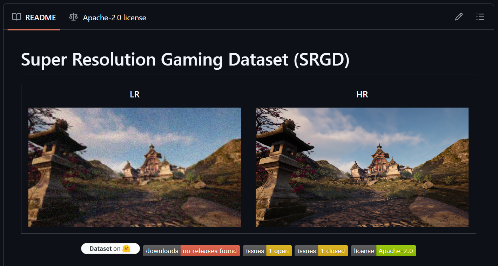
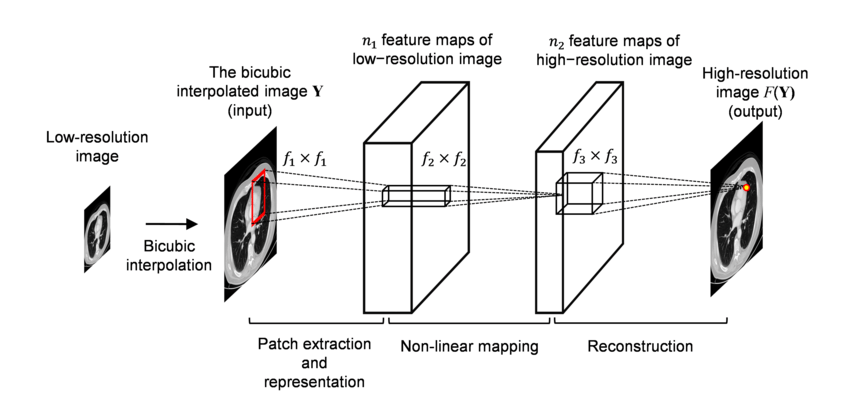
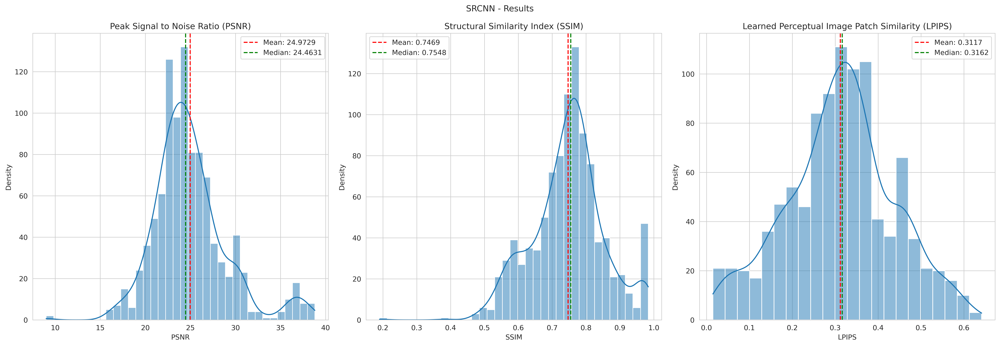
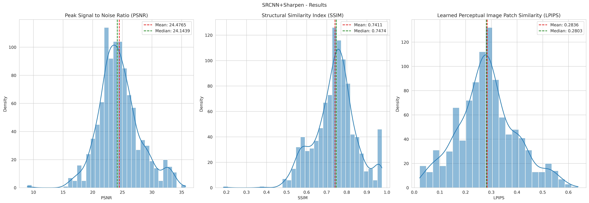
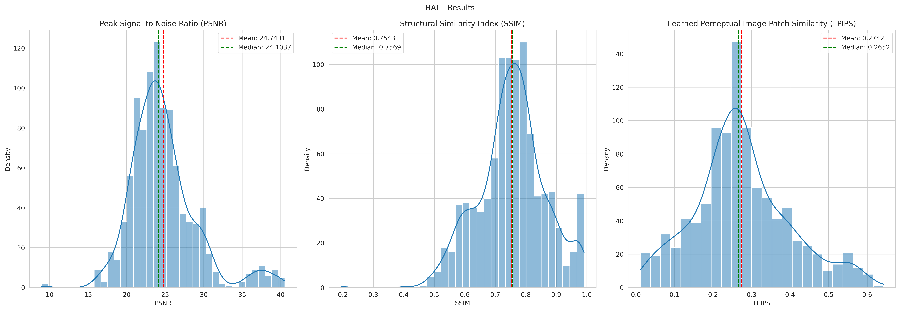
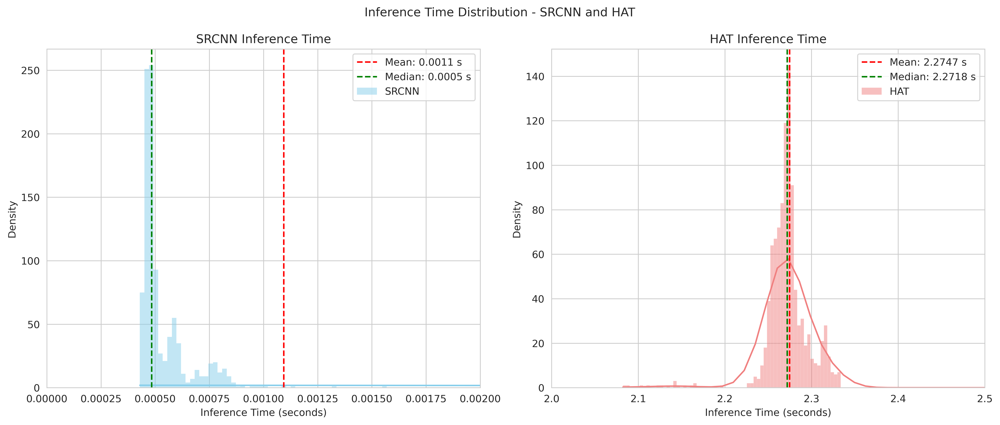

# Super Resolution In Video Games 🎮
### A Survey of Methods 🕹️

 
 
 

<small>

 Presented by Gabriel Ribeiro Gomes  
Introduction to Deep Learning - Prof. Paulo Ivson  
DI - Departamento de Informática @ PUC-Rio  
June 2025 

</small>

---

# Summary 📚

1. **Introduction**: What is Super Resolution? 🤔
2. **Related Work**: DLSS and FidelityFX 🔍
3. **Proposed Technique**: SRCNN and HAT models 🛠️
4. **Experiments and Results** 🚨
5. **Conclusions and Future Work** 📝

---

# What is Super Resolution? 🤔

Super Resolution (SR) enhances image or video resolution, making visuals clearer and more detailed.

- Uses algorithms to generate high-res images from low-res inputs.
- Key uses:
  - **Medical Imaging**: Better diagnostic images.
  - **Satellite Imagery**: Sharper analysis.
  - **Video Games**: Upscaled graphics without extra asset costs.

---

# Why Does SR Matter in Games? 🎮

Modern games demand high-quality visuals, but high-res assets are costly and resource-intensive.

- SR enables real-time upscaling from lower resolutions, saving resources while maintaining visual quality.
- Benefits:
  - **Performance**: Less hardware strain.
  - **Accessibility**: Playable on lower-end devices.
  - **Cost Efficiency**: Fewer high-res assets needed.

---

# DLSS and FidelityFX 🔍

DLSS (Deep Learning Super Sampling) and FidelityFX are leading SR technologies in gaming.

- **DLSS**: Developed by NVIDIA, uses AI to upscale images in real-time, enhancing performance without sacrificing quality.
- **FidelityFX**: AMD's solution, focuses on high-quality upscaling and image enhancement, compatible with a wide range of hardware.
- Both technologies leverage deep learning to improve image quality and performance in games.

---

# Open Source Alternatives 🔓

While DLSS is locked to NVIDIA hardware, more accessible alternatives are emerging. FidelityFX is open source and has a development SDK available.

- Also, there's room for new open-source solutions in the SR space, especially for video games.
- Open source SR solutions can democratize access to high-quality upscaling, allowing developers to implement advanced techniques without proprietary constraints.

---

# Proposed Approach 🛠️

- Use the SRGD as a benchmark for training and testing.
- Implement and evaluate the performance of two models not previously applied to SRGD:
  - **SRCNN** (Super-Resolution Convolutional Neural Network)
  - **HAT** (High-Performance Attention Transformer)

---

# SRCNN 🧠

> SRCNN is one of the first deep learning models for SR, using a simple CNN architecture to reconstruct high-res images from interpolated low-res inputs.

---

# HAT 🧠

> HAT uses a hybrid attention transformer architecture, enabling superior perceptual reconstruction at higher computational cost.

---

# Experiments and Results 🚨

For evaluating the performance of the models, we used the following metrics:

- **PSNR (Peak Signal-to-Noise Ratio)**: Measures the quality of the reconstructed image compared to the original.
- **SSIM (Structural Similarity Index)**: Assesses the structural similarity between the original and reconstructed images.
- **LPIPS (Learned Perceptual Image Patch Similarity)**: Evaluates perceptual similarity, focusing on how humans perceive differences in images.

---

# Machine Setup 🚨

| Setup Config    | Value          |
|-----------------|----------------|
| OS              | Linux 6.1.123+ |
| Processor       | x86_64         |
| Python Version  | 3.11.13        |
| Pytorch Version | 2.6.0+cu124    |
| GPU             | Tesla T4       |
| GPU Memory      | 16GB           |

---

# Results - Quality 🚨

| Model            | PSNR         | SSIM       | LPIPS      | SRGD       |
|------------------|--------------|------------|------------|------------|
| SRCNN            | **24.972**   | 0.746      | 0.311      | This Work  |
| SRCNN-Sharpened  | 24.476       | 0.741      | 0.283      | This Work  |
| Real-ESRGAN      | 23.540       | 0.799      | 0.392      | Yes        |
| EMT              | 24.544       | **0.823**  | 0.388      | Yes        |
| ResShift         | 23.036       | 0.799      | 0.482      | Yes        |
| HAT              | 24.743       | 0.754      | **0.274**  | This Work  |

---

# Results - Inference 🚨

We also got results for the inference time (IT) of the models, which is important for real-time applications like video games.

| Model            | Mean IT (s) | SD IT (s)  |
|------------------|-------------|------------|
| SRCNN            | 0.00109332  | 0.01748104 |
| HAT              | 2.27468708  | 0.07842106 |

The HAT model is much slower than SRCNN due to its complexity, which can limit its use in real-time scenarios where speed is crucial.

---

# Error Distribution - SRCNN 🚨

---

# Error Distribution - Sharpened 🚨

---

# Error Distribution - HAT 🚨

---

# Distribution of Inference Times 🚨

---

# Experiments and Results 🚨

---

# Conclusions and Future Work 📝

<small>

- We got a better PSNR on SRCNN models and a better LPIPS on the HAT model, but we still need to improve the SSIM metric.
- Overall, the HAT model shows superior performance in perceptual quality and structural integrity compared to SRCNN.
- We added new information to the SRGD, with the SRCNN (+ Sharpen) and HAT models, which can be used in future works.
- Training more time/epochs with more data and different hyperparameters could improve the results even further.
- Engineering was a bottleneck in this work, since computer vision requires intense CPU/GPU and RAM usage, and datasets are large (50GB+).

</small>

---

# <!-- fit --> Questions?
# <!-- fit --> 🤔🤔🤔🤔
